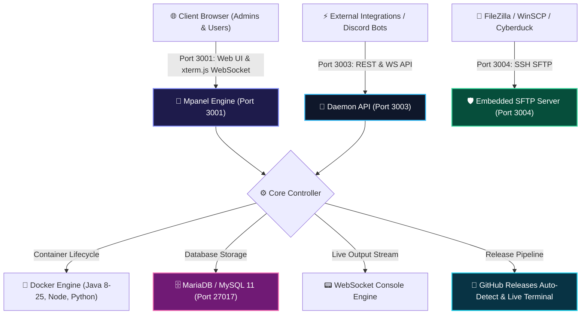

<!-- ============================================================================== -->
<!--                     🎮 MPANEL v2.5.2 - NEXT-GEN GAME & APP PANEL               -->
<!-- ============================================================================== -->

<p align="center">
  <a href="https://nobitahost.in">
    
  </a>
</p>

<p align="center">
  <a href="https://nobitahost.in">
    
  </a>
</p>

<p align="center">
  <a href="https://nodejs.org"></a>
  <a href="https://github.com/nobita329/Mpanel/releases/tag/v2.5.2"></a>
  <a href="https://nobitahost.in"></a>
  <a href="#-system-updates--live-terminal-engine"></a>
  <a href="#-theme--customization-engine"></a>
  <a href="LICENSE"></a>
</p>

<p align="center">
  <a href="#-quick-start"><b>🚀 Quick Start</b></a> •
  <a href="#-what-is-new-in-v252"><b>✨ What's New</b></a> •
  <a href="#-core-features--capabilities"><b>🧩 Features</b></a> •
  <a href="#-theme--customization-engine"><b>🎨 Themes</b></a> •
  <a href="#-architecture--port-matrix"><b>🔒 Ports</b></a> •
  <a href="#-directory-structure"><b>📁 Structure</b></a> •
  <a href="https://nobitahost.in"><b>🌐 Cloud Hosting</b></a>
</p>

---

## 📸 3D Live Showcase

<p align="center">
  
</p>

---

## ⚡ High-Speed Architecture & Workflow



---

## 🔒 Architecture & Port Matrix

| Service | Port | Protocol | Encryption | Description |
| :--- | :---: | :---: | :---: | :--- |
| **Web Panel UI** | `3001` | HTTP / WS | TLS / SSL | Main Web Dashboard & Live Console WebSocket |
| **Panel & Daemon API** | `3003` | HTTP / WS | Bearer JWT | REST & WS API for external bots, billing & WHMCS |
| **Embedded SFTP Server** | `3004` | SFTP | SSH2 RSA/ECDSA | Built-in high-speed file transfer (`sftp://host:3004`) |
| **Dedicated MariaDB Engine**| `27017`| TCP | Native Auth | Relational database server for Minecraft plugins & app databases |

---

## ✨ What is New in v2.5.2

<p align="center">
  
</p>

### 1. 🟢 Real-Time 5-State Server Lifecycle Engine
- **5 High-Accuracy Real-Time Statuses**:
  - 🟢 **Online / Started**: Server process running, ports active, telemetry streaming.
  - 🔴 **Offline / Stopped**: Process terminated, zero resource consumption.
  - 🟡 **Restarting**: Graceful reload sequence in progress.
  - 🔵 **Starting**: Process booting, initializing JVM/Node/Python runtime.
  - ⚫ **Stopping**: Graceful shutdown and file lock flushing in progress.
- **Optimistic Power Control & Status Synchronization**: Immediate UI badge update and button state locking upon clicking **Start**, **Stop**, **Restart**, or **Kill** to eliminate latency perception and prevent duplicated socket requests.
- **Dual-Source Status Resolution**: Combines real-time Docker container inspection with active process metrics for 100% accurate status reporting.

### 2. 📊 Glowing Telemetry Cards & Horizontal Parsentbars
- **Horizontal Smooth Percent Progress Bars (`.parsentbar`)**: High-contrast visual capacity bars showing real-time utilization beneath every metric.
- **Individual Glow Accents**:
  - ⚡ **CPU**: Cyan accent (`#06b6d4`) with percentage load indicator.
  - 🧠 **Memory**: Purple accent (`#a855f7`) with live dual readout (e.g., `512 MB / 2048 MB`).
  - 💾 **Disk**: Amber accent (`#f59e0b`) with capacity tracking.
  - 📥 **Inbound Network**: Emerald accent (`#10b981`) showing real-time download bandwidth.
  - 📤 **Outbound Network**: Rose accent (`#f43f5e`) showing real-time upload bandwidth.
- **Dual Metric Readout**: Displays both percentage progress bar and raw human-readable numbers (MB, GB, KB/s) side-by-side.

### 3. 🧭 Optimized Address & State-Reactive Uptime Grid
- **Adaptive `1.65fr : 1fr` Responsive Split**: Balanced layout prevents IP address, port, and subdomain truncation on standard and wide monitors.
- **1-Click Address Copy**: Integrated `data-addr` click-to-copy with instant visual copied checkmark feedback.
- **Reactive Uptime Pill**: Vibrantly pulses emerald when the server is online; seamlessly transitions to a muted slate pill when offline or stopped.

### 4. 🛡️ Admin-Only Server Deletion Security Hardening
- **Strict Backend Route Protection**: `DELETE /api/servers/:id` strictly validates `req.user.role === 'admin'`, returning `403 Forbidden` if a standard user attempts deletion.
- **Zero Accidental Deletions**: Standard users cannot delete instances.
- **Console Settings Tab Lockout**: The red "Delete Server" button in the Console Danger Zone is automatically hidden for regular users and replaced with an **"Admin Only"** locked badge.

### 5. 💻 Modernized `menu.sh` Management Interface
- **Official ASCII Banner**: Striking cyberpunk ASCII art header upon launching `./menu.sh`:
  ```
  ███╗   ███╗██████╗  █████╗ ███╗   ██╗███████╗██╗     
  ████╗ ████║██╔══██╗██╔══██╗████╗  ██║██╔════╝██║     
  ██╔████╔██║██████╔╝███████║██╔██╗ ██║█████╗  ██║     
  ██║╚██╔╝██║██╔═══╝ ██╔══██║██║╚██╗██║██╔══╝  ██║     
  ██║ ╚═╝ ██║██║     ██║  ██║██║ ╚████║███████╗███████╗
  ╚═╝     ╚═╝╚═╝     ╚═╝  ╚═╝╚═╝  ╚═══╝╚══════╝╚══════╝
  ```
- **Live System Telemetry Dashboard**: Real-time display of Public IP, Local Network IP, Active Port Matrix (`3001`, `3003`, `3004`, `27017`), and PM2 Daemon status (`ONLINE` / `STOPPED`).
- **Structured Modular Menus**: Main Menu, PM2 Process Suite, and Database Management menus with intuitive numeric selection.

### 6. 🌐 Standalone Server Instance Deployment Portal (`deploy.php`)
- **Dedicated Deployment Portal**: Modern web interface (`deploy.php` & `public/deploy.php`) for selecting server configurations, runtime types, hardware specs, and billing cycles with instant provisioning.

### 7. 🖥️ VM - KVM / No-KVM Virtualization Architecture
- Clean branding upgrade replacing legacy LumenVM with transparent **VM - KVM** (hardware-assisted kernel virtualization) and **No-KVM** (lightweight isolated containerization) presets across the server wizard and management console.

---

## ✨ What is New in v2.5.0

### 1. 🔄 System Updates & Auto-Detection Engine
- **GitHub Releases Auto-Detection**: Real-time checking against [nobita329/Mpanel/releases](https://github.com/nobita329/Mpanel/releases) with semver comparison.
- **Dedicated Updates Dashboard (`#admin-updates`)**:
  - Displays Installed Version vs Latest Release tag.
  - Formatted Markdown Changelog reader and Release History accordion.
  - Instant **"Check for Updates"** manual refresh button.
- **Interactive Live Update Terminal ("live update tarmil")**:
  - Full-featured embedded `xterm.js` terminal with cyber styling, auto-scrolling, clear screen, and log copying.
  - Streams update execution line-by-line in real-time over WebSocket (`/ws/admin/updates`).
  - **6-Step Pipeline Visualizer**: Pre-flight Verification ➔ Git Sync ➔ Dependencies (npm install) ➔ Database Migration ➔ PM2 Reload ➔ Health Verification.
  - Action buttons: "Start System Update (Full Auto)", "Sync Dependencies & Schema", "Check Git Status".
- **Global System Overview Integration (`#admin-overview`)**:
  - Titlebar Version Pill (`v2.5.0`) & dynamic Update Status Pill (`Up-to-Date` or `Update Available`).
  - High-visibility **Mpanel Release & Update Status Banner** with 1-click update actions.
  - Sidebar navigation notification badge (`UPDATE`).

### 2. 🎓 Interactive Auto Tutorials Engine (No Static Pages)
- **Auto-Guided Spotlight Tours (`public/js/autoTutorial.js`)**:
  - Focused backdrop lighting with pulsing highlight rings around active UI controls.
  - 7-second countdown auto-progression bar, pause/resume, audio chimes, and keyboard navigation (`Esc`, arrow keys, `Space`).
  - Includes **Client Portal Tour (`panel-tour`)** and **Server Console Tour (`server-tour`)**.
- **Live Configuration Simulators (`public/js/knowledge.js`)**:
  - **SFTP URI Generator**: Instant connection strings and commands for FileZilla & Cyberduck on Port `3004`.
  - **Minecraft Aikar GC RAM Calculator**: Interactive slider (1GB–64GB) calculating heap and GC flags dynamically.
  - **MariaDB Configuration YAML Generator**: Dynamic database config snippet generator for Port `27017`.
- **Admin ON/OFF Controls**:
  - Toggle Tutorials portal visibility in Admin Settings.
  - Toggle automatic first-login tour for new users with an instant admin "Test Tour" button.
- **Pure Naming**: Zero references to "Knowledge Base" across all user-facing UI, database settings, and modals.

### 3. 🎨 PteroX V2.0.2 Theme Suite
- **Complete Visual Assets**: High-resolution branding logos, status illustrations, and server card banners.
- **Theme Palette & Layouts**: Deep space dark mode (`#111525`), primary cyan (`#23aeea`), and accent orange (`#ff5108`).

### 4. 🛠️ McTools Blueprint Extension Suite
- **Integrated Extension**: Directly ported from [`nobita329/Nobita-Cloud (mctools.blueprint)`](https://github.com/nobita329/Nobita-Cloud/blob/main/thame/Extension/mctools.blueprint).
- **Live MOTD & Colored Text Builder**: Real-time Minecraft colored text builder (Sign, Book, Chat, MOTD) with live dark preview box and instant copy in Legacy (`&`), Section (`§`), Tellraw/JSON, and MiniMessage.
- **Color Palette & Swatches**: Official 16 Minecraft colors with hex codes, RGB picker, and Bungee hex formatting (`&x&r&r&g&g&b&b`).
- **SmallCaps & Unicode Decorative Fonts**: Real-time styler for SmallCaps, BigCaps, Bubble, Fraktur, FullWidth, Script, and Tiny fonts.
- **1,200+ Minecraft Registry Directory**: Fast searchable registry of 1,228 Items & Blocks, 149 Entities, 113 Particles, 1,651 Game Sounds, 42 Enchantments, and 40 Effects with 1-click `/give`, `/summon`, and `/particle` copy.
- **Inventory Slot Maps & Emojis**: Interactive slot indices for Chests, Hoppers, Furnaces, and Brewing Stands, plus 1,900+ Minecraft symbols.
- **1-Click Download**: Download `mctools.blueprint` directly from the Addon Marketplace.

---

## 🧩 Core Features & Capabilities

### 1. 👥 Minecraft Player Manager (Live Monitoring & Offline Roster)
- **Live Player Roster**: Connected players with live ping, gamemode, health, food bar, XP level, and UUID.
- **🎒 Interactive Live Inventory Viewer**: Inspect armor slots, offhand, main inventory, and ender chest with item icons, stack counts, and durability.
- **📊 Detailed Player Statistics**: In-depth tracking of mob kills, blocks mined, items crafted, and distance traveled.
- **🏆 Advancements & Achievements Tracker**: Complete advancement tree tracking across Story, Nether, The End, Adventure, and Husbandry.
- **⚡ Live Moderation Actions**: Instant Kick, Ban, Pardon, IP-Ban, OP (Levels 1–4), and DEOP.
- **🛡️ Full Offline Support**: Add/remove Whitelist entries, manage Operators, and ban/unban players even when the server is powered down.
- **🚀 1-Click Server Startup**: Direct power launch button inside Player Manager when the server is offline.

### 2. 🧩 Addon Marketplace (Consolidated A to Z Suite)
- **🌐 3 Universal Web Providers**:
  1. **Modrinth** (`https://modrinth.com`): Modern mods, plugins, datapacks, resource packs, and modpacks.
  2. **CurseForge** (`https://www.curseforge.com`): Full ecosystem integration via `CURSEFORGE_API_KEY` covering plugins, mods, worlds/maps, and modpacks.
  3. **SpigotMC** (`https://www.spigotmc.org`): Access to 90,000+ Bukkit, Spigot, and Paper plugins with version compatibility lists and 1-click `.jar` installation.
- **🎮 Minecraft Version Filtering (A to Z)**:
  - Comprehensive dropdown selector covering every release from **Minecraft 1.21 Tricky Trials** down to **1.5.2**, plus interactive quick version selector pills.
- **📂 Consolidated Categories**:
  - **Version Changer**: 1-click server core and engine switcher (Paper, Purpur, Spigot, Fabric, Forge, NeoForge, Velocity, BungeeCord).
  - **Player Manager**: Complete live and offline player moderation suite with inventory inspections.
  - **World Manager**: World creation, dimension management, CurseForge/Modrinth world store, instant generator profiles (Void, Superflat, Amplified, Large Biomes), and ZIP archive import/export.
  - **Plugins / Mods / Datapacks / Resource Packs / Modpacks**: 1-click deployment to appropriate folders.
  - **Properties UI**: Visual `server.properties` editor with dedicated **`[ 🟢 ON ]` `[ ⚪ OFF ]`** segmented switchers, live color-coded MOTD preview (`§` and `&` codes), and a **"Restart to Apply"** quick reboot button.
  - **Server Tools**: 1-click essential utility suite (ViaVersion, GeyserMC, Floodgate, Spark Profiler, Chunky, LuckPerms), Aikar's JVM performance flags, and Playit.gg tunnel manager.

### 3. 🔄 Minecraft Version Changer (MCJars Engine)
- Switch server software and Minecraft versions with a single click.
- Supported server cores:
  - **Paper**, **Purpur**, **Spigot**, **Vanilla**, **Fabric**, **Forge**, **NeoForge**, **BungeeCord**, **Velocity**, and **Bedrock Dedicated Server**.
- Automatic server jar backup, download verification, and configuration adjustments.

### 4. 🎨 Theme & Customization Engine
- **🖤 Full Black OLED**: Pure pitch black background (`#000000`), deep black frosted glass cards, and high-contrast neon accents.
- **🌌 PteroX V2**: High-tech deep space dark mode (`#111525`), primary cyan (`#23aeea`), and accent orange (`#ff5108`).
- **🌟 LiquidX**: Polished glassmorphism with custom gold and emerald accents.
- **💎 Arix**: Modern streamlined layout with deep blue palette.
- **🖼️ Integrated 4K Wallpapers Browser ([4kwallpapers.com](https://4kwallpapers.com/))**:
  - 36 categories, search, pagination, and 1-click apply across the panel.
- **📹 Custom Media Backgrounds**:
  - Upload custom high-res images (`JPG, PNG, WEBP, GIF`) or looping background videos (`MP4, WEBM` up to 100MB).
- **🎚️ Real-Time Sliders**: Dynamic opacity (0% to 100%) and blur (0px to 40px) sliders with debounced auto-save.

### 5. 🌐 Playit.gg Zero-Port Tunnel Integration
- **Addon Marketplace 1-Click Install**: Installs the latest official `playit-minecraft-plugin.jar` automatically into `plugins/` or `mods/`.
- **Live Status & Address Detection**: Scans logs to detect claim URLs and public player connection domains (`*.gl.joinmc.link`).
- **Native Linux System Daemon (playit CLI)**:
  - Accessible via `./menu.sh playit` or interactive `menu.sh` Option 8.

---

## 📦 Supported Runtimes & Environments

<p align="center">
  
  
  
</p>

---

## 🚀 Quick Start

### 1. ⚡ 1-Click Universal Auto Install (`menu.sh`)
Run the full automated installer directly from the web or locally:
```bash
# Instant One-Liner from GitHub
bash <(curl -sSL https://raw.githubusercontent.com/nobita329/Mpanel/main/menu.sh)

# Or locally
./menu.sh auto -y
# or interactive
./menu.sh auto
```

### 2. 🎮 Interactive Management Menu (`menu.sh`)
```bash
./menu.sh
# or
bash menu.sh
```

| Command Shortcut | Purpose |
| :--- | :--- |
| `./menu.sh auto` | 1-Click Auto Install, Setup, Database Seeding & PM2 Launch |
| `./menu.sh update` | 1-Click Auto Update (Git pull, DB migrations, dependencies & PM2 restart) |
| `./menu.sh usercreate` | Create new administrator or standard customer user |
| `./menu.sh pm2` | PM2 Process Management menu (Start, Stop, Restart, Logs, Autostart) |
| `./menu.sh db` | Database Suite (MariaDB/MySQL Docker engine & Migrations) |
| `./menu.sh status` | Check port listening status (`3001`, `3003`, `3004`, `27017`) and database |
| `./menu.sh playit` | Install native Playit.gg zero-port tunnel CLI |
| `./menu.sh uninstall`| Safely remove or clean Mpanel deployment |

### 3. 🛠️ Manual CLI Setup
```bash
# 1. Clone the repository
git clone https://github.com/nobita329/Mpanel.git
cd Mpanel
bash menu.sh

# 2. Install dependencies
npm install

# 3. Run automated directory, .env & database setup
npm run setup

# 4. Launch with PM2 in Cluster Mode
npm run pm2:start
npm run pm2:logs
```

---

## 📁 Directory Structure

```
/
├── bin/
│   ├── setup.js             # Automated setup, directory creator & database seeder
│   ├── createuser.js        # Interactive CLI user creation script
│   ├── migrate.js           # Database migration runner
│   └── build.js             # Directory verification & preparation script
├── mpanel/
│   ├── servers/             # Sandboxed server directories (server1, server2, ...)
│   └── backups/             # Server snapshot .zip archives
├── public/
│   ├── index.html           # Main SPA HTML structure
│   ├── deploy.php           # Public server deployment portal
│   ├── css/
│   │   └── style.css        # Multi-theme palettes & glassmorphic styling
│   └── js/
│       ├── app.js           # Core router, auth UI & toast notifications
│       ├── updates.js       # Auto-detect updates engine & live xterm.js terminal
│       ├── autoTutorial.js  # Spotlight guided walkthrough engine
│       ├── knowledge.js     # Tutorials Hub & live configuration generators
│       ├── admin.js         # Global System Overview, servers, users, telemetry
│       ├── settings.js      # Themes, 4K wallpapers, feature toggles
│       ├── marketplace.js   # CurseForge, Modrinth & SpigotMC marketplace
│       ├── playerManager.js # Minecraft Live Player Manager & Inventory Viewer
│       ├── worldManager.js  # Minecraft World Installer & Dimension Manager
│       ├── versionChanger.js# MCJars Version & Core switcher
│       ├── console.js       # Real-time xterm.js terminal & server controls
│       └── filemanager.js   # Sandboxed file manager & code editor
├── src/
│   ├── index.js             # Main server launcher (Ports 3001, 3003, 3004)
│   ├── config/              # App configurations & image presets
│   ├── database/
│   │   ├── db.js            # MariaDB / MySQL connection pool & queries
│   │   └── seed.js          # Database seeders
│   ├── middleware/          # JWT auth, admin permissions & file uploads
│   ├── routes/
│   │   ├── adminUpdateRoutes.js  # System updates API & git tracking
│   │   ├── adminRoutes.js        # Global telemetry & cluster administration
│   │   ├── adminSettingsRoutes.js# Settings & feature toggles
│   │   └── serverRoutes.js       # Server lifecycle & management
│   ├── services/
│   │   ├── updateService.js      # GitHub Releases auto-detect & pipeline runner
│   │   ├── runnerService.js      # Server process execution
│   │   └── wallpaperService.js   # 4KWallpapers scraper & category cache
│   ├── sftp/
│   │   └── sftpServer.js    # Embedded SSH2 SFTP Server on port 3004
│   └── websocket/
│       └── consoleWs.js     # Real-time WebSocket terminal & update streams
├── deploy.php               # Standalone server instance deployment portal
├── menu.sh                  # Interactive CLI management script & ASCII dashboard
└── ecosystem.config.js      # PM2 clustering configuration
```

---

## 🔒 SFTP Connection Details

Connect using any SFTP client (FileZilla, WinSCP, Cyberduck):
- **Host**: `localhost` (or server IP)
- **Port**: `3004`
- **Username**: `<username>.<server_id>` (e.g. `admin.1` for Server #1)
- **Password**: Your Mpanel account password

---

## 🛡️ Default Credentials
- **Username**: `admin`
- **Password**: `admin`
- **Login URL**: `http://localhost:3001`

---

## 👨‍💻 Creator & Developer

<p align="center">
  <a href="https://discord.com/users/924366651443527710" target="_blank">
    
  </a>
</p>

<p align="center">
  <b>Developed &amp; Engineered by Nobita (<code>nobita.dev</code>)</b><br/>
  💬 Discord: <a href="https://discord.com/users/924366651443527710" target="_blank"><code>nobita.dev</code> (ID: <code>924366651443527710</code>)</a> • Mention: <code>&lt;@924366651443527710&gt;</code><br/>
  ⚡ Live Presence: <b>Real-time Discord Gateway &amp; Lanyard Live Sync</b><br/>
  🌐 Official Website: <a href="https://nobitahost.in/" target="_blank"><b>https://nobitahost.in/</b></a>
</p>

---

<p align="center">
  <a href="https://nobitahost.in">
    
  </a>
</p>

<p align="center">
  <b>Mpanel</b> &copy; 2026 • Designed &amp; Engineered with ❤️ by <a href="https://nobitahost.in"><b>Nobita</b> (nobitahost.in)</a> • Licensed under the <a href="LICENSE">MIT License</a>
</p>
