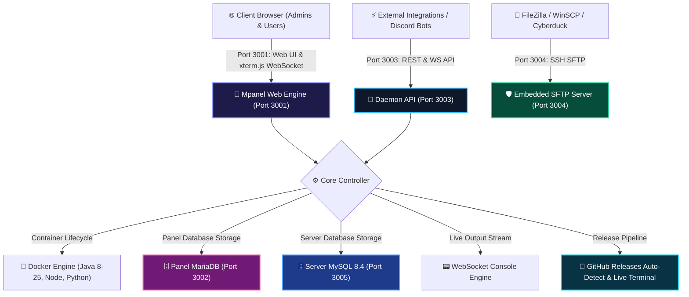

<!-- ============================================================================== -->
<!--                     🎮 MPANEL v2.5.4 - NEXT-GEN GAME & APP PANEL               -->
<!-- ============================================================================== -->

<p align="center">
  <a href="https://nobitahost.in">
    
  </a>
</p>

<p align="center">
  <a href="https://nobitahost.in">
    
  </a>
</p>

<h1 align="center">🎮 MPANEL v2.5.4</h1>
<p align="center">
  <b>High-Performance Game &amp; Application Server Web Management Engine for Node.js</b><br/>
  <i>Engineered with Glassmorphism UI, Multi-Database Architecture, Embedded SFTP &amp; Real-Time Telemetry</i>
</p>

<p align="center">
  <a href="https://nobitahost.in">
    
  </a>
</p>

<p align="center">
  <a href="https://nodejs.org"></a>
  <a href="https://github.com/nobita329/Mpanel/releases/tag/v2.5.4"></a>
  <a href="https://nobitahost.in"></a>
  <a href="#-architecture--port-matrix"></a>
  <a href="#-theme--customization-engine"></a>
  <a href="LICENSE"></a>
</p>

<p align="center">
  <a href="#-quick-start"><b>🚀 Quick Start</b></a> •
  <a href="#-what-is-new-in-v254"><b>✨ What's New</b></a> •
  <a href="#-database-configuration--docker-quickstart"><b>🗄️ Databases</b></a> •
  <a href="#-architecture--port-matrix"><b>🔒 Ports</b></a> •
  <a href="#-core-features--capabilities"><b>🧩 Features</b></a> •
  <a href="#-theme--customization-engine"><b>🎨 Themes</b></a> •
  <a href="#-directory-structure"><b>📁 Structure</b></a> •
  <a href="https://nobitahost.in"><b>🌐 Cloud Hosting</b></a>
</p>

---

## 📸 3D Live Showcase

<p align="center">
  
</p>

---

## ⚡ High-Speed Architecture & Workflow


```mermaid
graph TD
    Client["🌐 Client Browser (Admins & Users)"] -->|Port 3001: Web UI & xterm.js WebSocket| Gateway["🚀 Mpanel Web Engine (Port 3001)"]
    External["⚡ External Integrations / Discord Bots"] -->|Port 3003: REST & WS API| GatewayAPI["🔌 Daemon API (Port 3003)"]
    FTPClient["📁 FileZilla / WinSCP / Cyberduck"] -->|Port 3004: SSH SFTP| SFTP["🛡️ Embedded SFTP Server (Port 3004)"]

    Gateway --> EngineCore{"⚙️ Core Controller"}
    GatewayAPI --> EngineCore

    EngineCore -->|Container Lifecycle| Docker["🐳 Docker Engine (Java 8-25, Node, Python)"]
    EngineCore -->|Panel Database Storage| MariaDB["🗄️ Panel MariaDB (Port 3002)"]
    EngineCore -->|Server Database Storage| MySQLServer["🗄️ Server MySQL 8.4 (Port 3005)"]
    EngineCore -->|Live Output Stream| WSConsole["📟 WebSocket Console Engine"]
    EngineCore -->|Release Pipeline| AutoUpdater["🔄 GitHub Releases Auto-Detect & Live Terminal"]

    style Gateway fill:#1e1b4b,stroke:#818cf8,stroke-width:2px,color:#fff
    style GatewayAPI fill:#0f172a,stroke:#38bdf8,stroke-width:2px,color:#fff
    style SFTP fill:#064e3b,stroke:#34d399,stroke-width:2px,color:#fff
    style MariaDB fill:#701a75,stroke:#f472b6,stroke-width:2px,color:#fff
    style MySQLServer fill:#1e3a8a,stroke:#60a5fa,stroke-width:2px,color:#fff
    style AutoUpdater fill:#083344,stroke:#22d3ee,stroke-width:2px,color:#fff
```

---

## 🔒 Architecture & Port Matrix

| Service | Port | Protocol | Encryption | Description |
| :--- | :---: | :---: | :---: | :--- |
| **Web Panel UI** | `3001` | HTTP / WS | TLS / SSL | Main Web Dashboard & Live Console WebSocket |
| **Panel MariaDB Engine** | `3002` | TCP | Native Auth | Dedicated Panel Database (Docker: `mariadb:latest`) |
| **Panel & Daemon API** | `3003` | HTTP / WS | Bearer JWT | REST & WS API for external bots, billing & WHMCS |
| **Embedded SFTP Server** | `3004` | SFTP | SSH2 RSA/ECDSA | Built-in high-speed file transfer (`sftp://host:3004`) |
| **Server Game DB (MySQL 8.4)**| `3005` / `3306`| TCP | Native Auth | Dedicated Game Server Database (Docker: `mysql:8.4`) |

---

## 🗄️ Database Configuration & Docker Quickstart

Mpanel uses an enterprise-grade multi-database architecture dividing Panel internal state and Game Server database services:

### 1. Panel Database (MariaDB - Port 3002)
Runs the internal Panel authentication, server records, users, and telemetry data:
```bash
# ================== Panel DB Only =========================
docker run -d \
  --name mariadb \
  -e MARIADB_ROOT_PASSWORD=Nova \
  -e MARIADB_DATABASE=Nova \
  -e MARIADB_USER=Nova \
  -e MARIADB_PASSWORD=NovaStudio \
  -p 3002:3306 \
  -v mariadb_data:/var/lib/mysql \
  --restart unless-stopped \
  mariadb:latest
```

### 2. Game Server Database (MySQL 8.4 - Port 3005 & 3306)
Runs user databases for Minecraft plugins (LuckPerms, CoreProtect), Discord bots, and game databases:
```bash
# =================== Server DB Only ==========================
docker run -d \
  --name mysql \
  -e MYSQL_ROOT_PASSWORD=YourStrongPassword \
  -e MYSQL_DATABASE=mydatabase \
  -e MYSQL_USER=myuser \
  -e MYSQL_PASSWORD=YourUserPassword \
  -p 3005:3306 \
  -p 3306:3306 \
  -v mysql_data:/var/lib/mysql \
  --restart unless-stopped \
  mysql:8.4
```

### 3. Environment Configuration (`.env`)
```env
# Application Settings
PANEL_NAME=Mpanel
PORT=3001
API_PORT=3003
SFTP_PORT=3004
JWT_SECRET=your_super_secret_jwt_key_here

# Panel MariaDB Configuration
DB_HOST=127.0.0.1
DB_PORT=3002
DB_USER=panel
DB_PASSWORD=PanelPass123!
DB_NAME=panel

# Server Database Configuration (MySQL 8.4)
SERVER_DB_HOST=127.0.0.1
SERVER_DB_PORT=3005
SERVER_DB_USER=root
SERVER_DB_PASSWORD=YourStrongPassword
SERVER_DB_DATABASE=mydatabase
```

---

## ✨ What is New in v2.5.4

### 1. 🌟 Official Brand Identity: 3D Gold/Purple Logo & Arcade Banner
- **Futuristic 3D Metallic Mpanel Logo**: High-definition gold-accented cyber emblem with glowing purple neon rings and server towers (`public/assets/logo.png`).
- **Retro-Futuristic Nova Studio CRT Arcade Banner**: Cyberpunk scanline arcade visual with glowing blue neon text (`public/assets/banner.png`).
- Seamlessly integrated across Web Header, Login Modals, Dynamic Favicons, Theme Switchers, and Settings previews.

### 2. 🔔 Neon Glassmorphic Notification & Modal UI Engine
- **Custom `app.prompt(...)` Modal Dialogs**: Completely eliminated all 18 native browser `prompt(...)` popups throughout:
  - Sandboxed File Manager (New File, New Folder, Rename, Archive Extraction).
  - Web Console (Send Command, Fast Actions).
  - Config Editor (Variable Modifiers, Property Overrides).
  - World Manager (Dimension Creation, World Imports).
  - Server Importer & Migration Suite.
  - Admin Settings & Node Manager.
- **Glassmorphic Confirm (`app.confirm`) & Toast System**: Rich floating notifications with auto-dismiss countdowns, success/warning/error glows, and fluid micro-animations.

### 3. 🗄️ Multi-Engine Dual Database Architecture
- Native separation between internal Panel MariaDB (`Port 3002`) and external Game Server MySQL 8.4 (`Port 3005`).
- Preconfigured Docker deployment one-liners with persistence volumes and restart policies.

### 4. 💻 Modernized `menu.sh` Management Interface
- **Cyberpunk ASCII Art Header**:
  ```
  ███╗   ███╗██████╗  █████╗ ███╗   ██╗███████╗██╗     
  ████╗ ████║██╔══██╗██╔══██╗████╗  ██║██╔════╝██║     
  ██╔████╔██║██████╔╝███████║██╔██╗ ██║█████╗  ██║     
  ██║╚██╔╝██║██╔═══╝ ██╔══██║██║╚██╗██║██╔══╝  ██║     
  ██║ ╚═╝ ██║██║     ██║  ██║██║ ╚████║███████╗███████╗
  ╚═╝     ╚═╝╚═╝     ╚═╝  ╚═╝╚═╝  ╚═══╝╚══════╝╚══════╝
  ```
- **Real-Time Telemetry Matrix**: Live display of Public IP, LAN IP, Ports (`3001`, `3002`, `3003`, `3004`, `3005`), and PM2 Daemon state.
- **1-Click Menu Database Provisioning**: Dedicated submenu to deploy MariaDB and MySQL containers instantly.

### 5. 🚀 Automated GitHub Release & Tag CI/CD (`.github/workflows/release.yml`)
- Automated build, version tag generation, and GitHub release notes publishing on every repository push to `main`.

---

## 🧩 Core Features & Capabilities

### 1. 👥 Minecraft Player Manager (Live Monitoring & Offline Roster)
- **Live Player Roster**: Connected players with live ping, gamemode, health, food bar, XP level, and UUID.
- **🎒 Interactive Live Inventory Viewer**: Inspect armor slots, offhand, main inventory, and ender chest with item icons, stack counts, and durability.
- **📊 Detailed Player Statistics**: In-depth tracking of mob kills, blocks mined, items crafted, and distance traveled.
- **🏆 Advancements & Achievements Tracker**: Complete advancement tree tracking across Story, Nether, The End, Adventure, and Husbandry.
- **⚡ Live Moderation Actions**: Instant Kick, Ban, Pardon, IP-Ban, OP (Levels 1–4), and DEOP.
- **🛡️ Full Offline Support**: Add/remove Whitelist entries, manage Operators, and ban/unban players even when the server is powered down.
- **🚀 1-Click Server Startup**: Direct power launch button inside Player Manager when the server is offline.

### 2. 🧩 Addon Marketplace (Consolidated A to Z Suite)
- **🌐 3 Universal Web Providers**:
  1. **Modrinth** (`https://modrinth.com`): Modern mods, plugins, datapacks, resource packs, and modpacks.
  2. **CurseForge** (`https://www.curseforge.com`): Full ecosystem integration via `CURSEFORGE_API_KEY` covering plugins, mods, worlds/maps, and modpacks.
  3. **SpigotMC** (`https://www.spigotmc.org`): Access to 90,000+ Bukkit, Spigot, and Paper plugins with version compatibility lists and 1-click `.jar` installation.
- **🎮 Minecraft Version Filtering (A to Z)**:
  - Comprehensive dropdown selector covering every release from **Minecraft 1.21 Tricky Trials** down to **1.5.2**, plus interactive quick version selector pills.
- **📂 Consolidated Categories**:
  - **Version Changer**: 1-click server core and engine switcher (Paper, Purpur, Spigot, Fabric, Forge, NeoForge, Velocity, BungeeCord).
  - **Player Manager**: Complete live and offline player moderation suite with inventory inspections.
  - **World Manager**: World creation, dimension management, CurseForge/Modrinth world store, instant generator profiles (Void, Superflat, Amplified, Large Biomes), and ZIP archive import/export.
  - **Plugins / Mods / Datapacks / Resource Packs / Modpacks**: 1-click deployment to appropriate folders.
  - **Properties UI**: Visual `server.properties` editor with dedicated **`[ 🟢 ON ]` `[ ⚪ OFF ]`** segmented switchers, live color-coded MOTD preview (`§` and `&` codes), and a **"Restart to Apply"** quick reboot button.
  - **Server Tools**: 1-click essential utility suite (ViaVersion, GeyserMC, Floodgate, Spark Profiler, Chunky, LuckPerms), Aikar's JVM performance flags, and Playit.gg tunnel manager.

### 3. 🔄 Minecraft Version Changer (MCJars Engine)
- Switch server software and Minecraft versions with a single click.
- Supported server cores:
  - **Paper**, **Purpur**, **Spigot**, **Vanilla**, **Fabric**, **Forge**, **NeoForge**, **BungeeCord**, **Velocity**, and **Bedrock Dedicated Server**.
- Automatic server jar backup, download verification, and configuration adjustments.

### 4. 🎨 Theme & Customization Engine
- **🖤 Full Black OLED**: Pure pitch black background (`#000000`), deep black frosted glass cards, and high-contrast neon accents.
- **🌌 PteroX V2**: High-tech deep space dark mode (`#111525`), primary cyan (`#23aeea`), and accent orange (`#ff5108`).
- **🌟 LiquidX**: Polished glassmorphism with custom gold and emerald accents.
- **💎 Arix**: Modern streamlined layout with deep blue palette.
- **🖼️ Integrated 4K Wallpapers Browser ([4kwallpapers.com](https://4kwallpapers.com/))**:
  - 36 categories, search, pagination, and 1-click apply across the panel.
- **📹 Custom Media Backgrounds**:
  - Upload custom high-res images (`JPG, PNG, WEBP, GIF`) or looping background videos (`MP4, WEBM` up to 100MB).
- **🎚️ Real-Time Sliders**: Dynamic opacity (0% to 100%) and blur (0px to 40px) sliders with debounced auto-save.

### 5. 🌐 Playit.gg Zero-Port Tunnel Integration
- **Addon Marketplace 1-Click Install**: Installs the latest official `playit-minecraft-plugin.jar` automatically into `plugins/` or `mods/`.
- **Live Status & Address Detection**: Scans logs to detect claim URLs and public player connection domains (`*.gl.joinmc.link`).
- **Native Linux System Daemon (playit CLI)**:
  - Accessible via `./menu.sh playit` or interactive `menu.sh` Option 8.

---

## 📦 Supported Runtimes & Environments

<p align="center">
  
  
  
</p>

---

## 🚀 Quick Start

### 1. ⚡ 1-Click Universal Auto Install (`menu.sh`)
Run the full automated installer directly from the web or locally:

```bash
# Instant One-Liner from GitHub
bash <(curl -sSL https://raw.githubusercontent.com/nobita329/Mpanel/main/menu.sh)

# Or locally
./menu.sh auto -y
# or interactive
./menu.sh auto
```

### 2. 🎮 Interactive Management Menu (`menu.sh`)
```bash
./menu.sh
# or
bash menu.sh
```

| Command Shortcut | Purpose |
| :--- | :--- |
| `./menu.sh auto` | 1-Click Auto Install, Setup, Database Seeding & PM2 Launch |
| `./menu.sh update` | 1-Click Auto Update (Git pull, DB migrations, dependencies & PM2 restart) |
| `./menu.sh usercreate` | Create new administrator or standard customer user |
| `./menu.sh pm2` | PM2 Process Management menu (Start, Stop, Restart, Logs, Autostart) |
| `./menu.sh db` | Database Suite (MariaDB/MySQL Docker engine & Migrations) |
| `./menu.sh status` | Check port listening status (`3001`, `3002`, `3003`, `3004`, `3005`) and database |
| `./menu.sh playit` | Install native Playit.gg zero-port tunnel CLI |
| `./menu.sh uninstall`| Safely remove or clean Mpanel deployment |

### 3. 🛠️ Manual CLI Setup
```bash
# 1. Clone the repository
git clone https://github.com/nobita329/Mpanel.git
cd Mpanel
bash menu.sh

# 2. Install dependencies
npm install

# 3. Run automated directory, .env & database setup
npm run setup

# 4. Launch with PM2 in Cluster Mode
npm run pm2:start
npm run pm2:logs
```

---

## 📁 Directory Structure

```
/
├── bin/
│   ├── setup.js             # Automated setup, directory creator & database seeder
│   ├── createuser.js        # Interactive CLI user creation script
│   ├── migrate.js           # Database migration runner
│   └── build.js             # Directory verification & preparation script
├── mpanel/
│   ├── servers/             # Sandboxed server directories (server1, server2, ...)
│   └── backups/             # Server snapshot .zip archives
├── public/
│   ├── assets/              # Brand assets: logo.png, banner.png, console preview
│   ├── index.html           # Main SPA HTML structure
│   ├── deploy.php           # Public server deployment portal
│   ├── css/
│   │   └── style.css        # Multi-theme palettes & glassmorphic styling
│   └── js/
│       ├── app.js           # Core router, auth UI, app.prompt & toast notifications
│       ├── updates.js       # Auto-detect updates engine & live xterm.js terminal
│       ├── autoTutorial.js  # Spotlight guided walkthrough engine
│       ├── knowledge.js     # Tutorials Hub & live configuration generators
│       ├── admin.js         # Global System Overview, servers, users, telemetry
│       ├── settings.js      # Themes, 4K wallpapers, feature toggles
│       ├── marketplace.js   # CurseForge, Modrinth & SpigotMC marketplace
│       ├── playerManager.js # Minecraft Live Player Manager & Inventory Viewer
│       ├── worldManager.js  # Minecraft World Installer & Dimension Manager
│       ├── versionChanger.js# MCJars Version & Core switcher
│       ├── console.js       # Real-time xterm.js terminal & server controls
│       └── filemanager.js   # Sandboxed file manager & code editor
├── src/
│   ├── index.js             # Main server launcher (Ports 3001, 3003, 3004)
│   ├── config/              # App configurations & image presets
│   ├── database/
│   │   ├── db.js            # MariaDB / MySQL connection pool & queries
│   │   └── seed.js          # Database seeders
│   ├── middleware/          # JWT auth, admin permissions & file uploads
│   ├── routes/
│   │   ├── adminUpdateRoutes.js  # System updates API & git tracking
│   │   ├── adminRoutes.js        # Global telemetry & cluster administration
│   │   ├── adminSettingsRoutes.js# Settings & feature toggles
│   │   └── serverRoutes.js       # Server lifecycle & management
│   ├── services/
│   │   ├── updateService.js      # GitHub Releases auto-detect & pipeline runner
│   │   ├── runnerService.js      # Server process execution
│   │   └── wallpaperService.js   # 4KWallpapers scraper & category cache
│   ├── sftp/
│   │   └── sftpServer.js    # Embedded SSH2 SFTP Server on port 3004
│   └── websocket/
│       └── consoleWs.js     # Real-time WebSocket terminal & update streams
├── deploy.php               # Standalone server instance deployment portal
├── menu.sh                  # Interactive CLI management script & ASCII dashboard
└── ecosystem.config.js      # PM2 clustering configuration
```

---

## 🔒 SFTP Connection Details

Connect using any SFTP client (FileZilla, WinSCP, Cyberduck):
- **Host**: `localhost` (or server IP)
- **Port**: `3004`
- **Username**: `<username>.<server_id>` (e.g. `admin.1` for Server #1)
- **Password**: Your Mpanel account password

---

## 🛡️ Default Credentials
- **Username**: `admin`
- **Password**: `admin`
- **Login URL**: `http://localhost:3001`

---

## 👨‍💻 Creator & Developer

<p align="center">
  <a href="https://discord.com/users/924366651443527710" target="_blank">
    
  </a>
</p>

<p align="center">
  <b>Developed &amp; Engineered by Nobita (<code>nobita.dev</code>)</b><br/>
  💬 Discord: <a href="https://discord.com/users/924366651443527710" target="_blank"><code>nobita.dev</code> (ID: <code>924366651443527710</code>)</a> • Mention: <code>&lt;@924366651443527710&gt;</code><br/>
  ⚡ Live Presence: <b>Real-time Discord Gateway &amp; Lanyard Live Sync</b><br/>
  🌐 Official Website: <a href="https://nobitahost.in/" target="_blank"><b>https://nobitahost.in/</b></a>
</p>

---

<p align="center">
  <a href="https://nobitahost.in">
    
  </a>
</p>

<p align="center">
  <b>Mpanel</b> &copy; 2026 • Designed &amp; Engineered with ❤️ by <a href="https://nobitahost.in"><b>Nobita</b> (nobitahost.in)</a> • Licensed under the <a href="LICENSE">MIT License</a>
</p>
